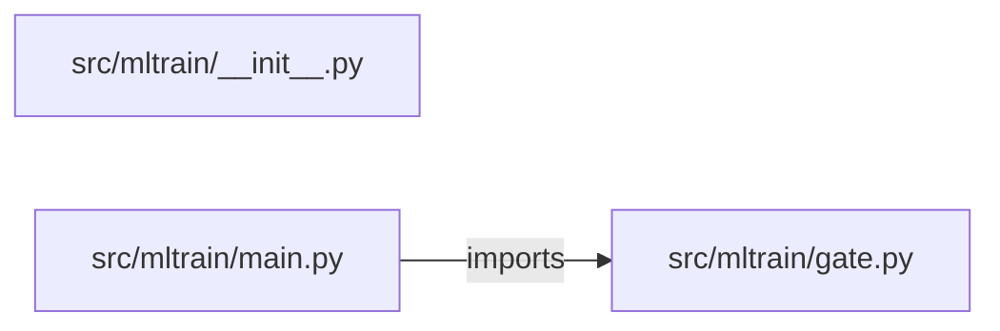

# end-to-end-ml-training-platform — project architecture

[README](README.md) · [Interview questions and answers](INTERVIEW_QA.md)

## Purpose and scope

Pass when dataset, trainer, and evaluator are all present. Applied false.

This document describes files and symbols in this checkout. Deployment templates and statements in the original overview are distinguished from a verified running environment.

## Component diagram



For Python repositories, arrows show resolved local imports, not network calls or deployment order. Otherwise the diagram is a repository component map; containment arrows do not assert runtime integration.

## Components and responsibilities

| Component | Responsibility |
| --- | --- |
| [`src/mltrain/main.py`](src/mltrain/main.py) | HTTP handlers: `GET /healthz`, `POST /check` |
| [`src/mltrain/gate.py`](src/mltrain/gate.py) | Functions: `check` |
| [`requirements.txt`](requirements.txt) | Implementation or supporting configuration |
| [`src/mltrain/__init__.py`](src/mltrain/__init__.py) | Implementation or supporting configuration |
| [`tests/test_gate.py`](tests/test_gate.py) | Executable checks and regression examples |
| [`.github/workflows/ci.yml`](.github/workflows/ci.yml) | GitHub Actions job definitions |
| [`README.md`](README.md) | Project explanations or operating notes |

## Request interface

| Method and path | Handler | Source |
| --- | --- | --- |
| `GET /healthz` | `healthz` | [`src/mltrain/main.py`](src/mltrain/main.py#L8) |
| `POST /check` | `post_check` | [`src/mltrain/main.py`](src/mltrain/main.py#L13) |

The table lists literal route decorators found in the inspected Python modules. Router prefixes and middleware can add behavior; check the linked handler and application setup before calling an endpoint.

## Implementation walkthrough

### `check(body)`

Source: [`src/mltrain/gate.py`](src/mltrain/gate.py#L5).

Calls visible in this function: `InputError`, `body.get`, `failed.append`, `isinstance`.

```python
def check(body):
    if not isinstance(body, dict):
        raise InputError("body must be an object")
    failed = []

    for key in ("dataset", "trainer", "evaluator"):
        if not body.get(key): failed.append(f"missing_{key}")
    return {"passed": not failed, "failed": failed, "applied": False}
```

## Validation and failure paths

| Explicit exception | Source |
| --- | --- |
| `InputError('body must be an object')` | [`src/mltrain/gate.py`](src/mltrain/gate.py#L7) |
| `HTTPException(status_code=422, detail=str(exc))` | [`src/mltrain/main.py`](src/mltrain/main.py#L17) |

These are explicit exceptions in the inspected source, rather than a claim that every failure is handled. Follow the calling handler to see whether the exception becomes an HTTP response or propagates.

## Data flow and design decisions

### What is the input-to-output contract of `check`

In [`src/mltrain/gate.py`](src/mltrain/gate.py#L5), `check(body)` receives the inputs. The function computes these intermediate values:

- `failed = []`

Its result is defined by:

- `{'passed': not failed, 'failed': failed, 'applied': False}`

### Which decision rules or boundary conditions should an interviewer challenge

The implementation in [`src/mltrain/gate.py`](src/mltrain/gate.py#L5) branches on:

- `not isinstance(body, dict)`
- `not body.get(key)`

A useful extension is a table-driven test that covers each condition just below, at, and above its boundary where applicable. These expressions are the current rules; changing them changes behavior and should be justified by the project’s acceptance criteria.

## Setup and verification

The following commands are derived from the checked-in dependency/test contracts. Execute them from the repository root; the block prepares a local environment, not a cloud deployment.

```bash
python3 -m venv .venv
source .venv/bin/activate
python -m pip install -r requirements.txt
python -m pytest -q
```

Python dependencies: [`requirements.txt`](requirements.txt).

Test entry points: [`tests/test_gate.py`](tests/test_gate.py).

Automation definitions: [`.github/workflows/ci.yml`](.github/workflows/ci.yml). Read their triggers and job steps to determine what CI actually runs.

## Operating boundaries and design review

Before turning this checkout into a customer deployment, establish the input contract, data ownership, access controls, failure response, evaluation criteria, and rollback owner. Repository fixtures and unit tests demonstrate local behavior; they do not establish throughput, uptime, compliance, or business impact.

A useful architecture review starts with the linked implementation: identify where input enters, where a decision is made, which state can change, and which external dependency can fail. Add a deployment view only for infrastructure that is actually configured and exercised.
